# Camellia Report

---

## Table of Contents

- [Camellia Report](#camellia-report)
  - [Table of Contents](#table-of-contents)
  - [1. Introduction](#1-introduction)
  - [2. Project Repository \& File Structure](#2-project-repository--file-structure)
  - [3. VHDL Source Files](#3-vhdl-source-files)
      - [**crypto.vhd**](#cryptovhd)
      - [**dma\_in.vhd**](#dma_invhd)
      - [**dma\_join.vhd**](#dma_joinvhd)
      - [**dma\_out.vhd**](#dma_outvhd)
      - [**dma\_split.vhd**](#dma_splitvhd)
      - [**fifo.vhd**](#fifovhd)
      - [**gcm\_pkg.vhd**](#gcm_pkgvhd)
      - [**gcm.vhd**](#gcmvhd)
      - [**gctr.vhd**](#gctrvhd)
      - [**ghash.vhd**](#ghashvhd)
      - [**mob.vhd**](#mobvhd)
      - [**camellia\_fsm1.vhd**](#camellia_fsm1vhd)
      - [**key\_sched.vhd**](#key_schedvhd)
  - [4. Detailed Design](#4-detailed-design)
    - [4.1. Design Choices \& Partitioning](#41-design-choices--partitioning)
      - [Partitioning](#partitioning)
      - [Camellia Pipelined vs State Machine](#camellia-pipelined-vs-state-machine)
      - [Camellia inside vs outside GCTR](#camellia-inside-vs-outside-gctr)
      - [Ciphertext hashing acceleration](#ciphertext-hashing-acceleration)
      - [AXI interface management](#axi-interface-management)
    - [4.2. Controller / Interface](#42-controller--interface)
      - [CRYPTO](#crypto)
      - [DMA IN](#dma-in)
      - [DMA OUT](#dma-out)
    - [4.3. State Machines](#43-state-machines)
      - [CRYPTO](#crypto-1)
      - [DMA\_IN](#dma_in)
      - [DMA\_OUT](#dma_out)
      - [GCM](#gcm)
      - [GHASH](#ghash)
      - [CAMELLIA\_CORE](#camellia_core)
      - [KEY\_SCHED](#key_sched)
    - [4.4. Other block diagrams](#44-other-block-diagrams)
      - [**GCM**](#gcm-1)
      - [**CAMELLIA**](#camellia)
    - [4.5. Software-Hardware Interface](#45-software-hardware-interface)
  - [5. Validation \& Testing](#5-validation--testing)
  - [6. Synthesis Results](#6-synthesis-results)
    - [**LUT**](#lut)
    - [Max Frequency](#max-frequency)
    - [Analysis](#analysis)
  - [7. Performance](#7-performance)
    - [Python](#python)
    - [C Driver](#c-driver)
  - [8. User Documentation](#8-user-documentation)
  - [9. Use of AI tools](#9-use-of-ai-tools)
    - [9.1 Tools Used](#91-tools-used)
    - [9.2 Examples of Interactions](#92-examples-of-interactions)
    - [9.3 Assessment](#93-assessment)
  - [10. Use of External Resources](#10-use-of-external-resources)
  - [11. Authors](#11-authors)

---

## 1. Introduction

This project implements the Camellia encryption algorithm on an FPGA board using VHDL.

It uses a combination of software on the ARM processor and custom hardware in the FPGA to encrypt data efficiently.

The software sets up the operation by sending parameters like the key and data locations, then starts the hardware, which processes the data on its own and stores the result in memory.

---

## 2. Project Repository & File Structure

The `final` branch contains the following files:

```
final/
├── REPORT.md               -- final report
├── README.md               -- project specifications
├── doc/
|		├── attachments/        -- report images library
|		└── files/              -- pdf documentation
├── on-board_replication/
|		├── build_zybo.tcl      -- tcl file used to synthetize our work
|		├── fpga.bit            -- bitstream file we used for test
|		├── test_vectors.json   -- set of test we did (10 per key size)
|		├── full_test.py        -- test execution script on-board
|		├── c_driver_test.c     -- script used to test the C driver functions
|		└── driver/             -- header and C code of the C driver
└── vhdl/crypto/
		├── crypto.vhd          -- top-level wrapper (AXI-Stream interface)
		├── camellia_fsm1.vhd   -- Camellia block cipher core
		├── key_sched.vhd       -- Camellia key schedule
		├── gcm.vhd             -- GCM top-level (ties GCTR and GHASH)
		├── gcm_pkg.vhd         -- shared types and constants for GCM
		├── gctr.vhd            -- GCTR (CTR mode encryption) datapath
		├── ghash.vhd           -- GHASH authentication datapath
		├── mob.vhd             -- multiply-over-GF(2^128) block for GHASH
		├── dma_in.vhd          -- AXI-Stream slave: incoming data
		├── dma_out.vhd         -- AXI-Stream master: outgoing data
		├── dma_split.vhd       -- splits AXI stream into header and payload
		├── dma_join.vhd        -- merges payload and tag into output stream
		├── fifo.vhd            -- generic synchronous FIFO
		├── camellia.py         -- Camellia software reference (validation)
		├── gctr.py             -- GCTR software reference (validation)
		└── mob.py              -- GF(2^128) multiply reference (validation)
```

---

## 3. VHDL Source Files

#### **crypto.vhd**

Design of `crypto`

Top-level entity exposed to the AXI-Stream DMA fabric. Instantiates and interconnects the DMA front-end, GCM core, and Camellia cipher modules. Handles reset synchronisation and any required clock-domain interfacing.

`crypto` uses `dma_in` , `dma_out` and `gcm` as components.

#### **dma_in.vhd**

Design of `dma_in`

Receives input data from the board, including plaintext, key, IV and associated headers.

`dma_in` uses `dma_join` as a component

#### **dma_join.vhd**

Design of `dma_join`

Joins input 32 bit blocks into 128 bit blocks for the crypto interface.

#### **dma_out.vhd**

Design of `dma_out`

Sends output data to the board, including ciphertext and tag. 

`dma_out` uses `dma_split` as a component

#### **dma_split.vhd**

Design of `dma_split`

Separates output 128 bit blocks into 32 bit blocks for the AXI interface.

#### **fifo.vhd**

Design of `fifo`.

Parameterisable FIFO supporting configurable data widths and depths. This implementation is the one given during the lecture.

#### **gcm_pkg.vhd**

Defines shared constants, data types, subtypes, S-Box and helper functions used throughout the GCM implementation.

#### **gcm.vhd**

Design of `gcm`.

Coordinates all GCM operations. Generates the hash subkey H, controls GCTR encryption, supplies AAD and ciphertext blocks to GHASH, and produces the final authentication tag. Contains the main control finite-state machine.

`gcm`  uses `ghash_core` and `gctr` as components.

#### **gctr.vhd**

Design of `gctr`. Implements Galois Counter Mode encryption. Increments the counter portion of the IV, encrypts counter blocks using Camellia, and XORs the resulting keystream with input data blocks. `gctr` component uses `camellia_core` as a component.

#### **ghash.vhd**

Design of `ghash_core`.

Implements the GHASH authentication function. Processes AAD and ciphertext blocks sequentially and performs finite-field multiplication.

`ghash_core` uses  `mob` as a component

#### **mob.vhd**

Design of `mob`  component.

Implements Multiplication operation on blocks, the Galois field multiplication with the GCM reduction polynomial.

#### **camellia_fsm1.vhd**

Design of `camellia_core`.

Implements the 128-bit Camellia block cipher encryption. Contains the round-function control FSM, FL/FL⁻¹ transformations, and S-box operations. Supports key sizes of 128, 192 and 256 bits.

`camellia_core` uses  `camellia_key_scheduler` as a component.

#### **key_sched.vhd**

Design of `camellia_key_scheduler` component.

Generates the round keys required by the Camellia cipher from the master key.

---

## 4. Detailed Design

> NOTE - All the block diagrams are available in doc/attachment/

### 4.1. Design Choices & Partitioning

#### Partitioning

The partitioning was all and all pretty straight-forward as we were inspired for the whole system by the camellia and gcm documentation. Apart from this, it seemed really logical to make the whole thing like that (e.g. the key scheduled inside of camellia core).

For DMA_in and DMA_out, Pr. Pacalet suggested us the design of both so we just followed his advice.

---

#### Camellia Pipelined vs State Machine

An early choice we had to do is choosing between a pipelined and a state machine camellia architecture. 

First, we thought of doing a partially unrolled dual-pipeline, meaning we could have two pipelines doing three camellia rounds per clock cycle, to maximize the throughput. This architecture introduces a lot of stalling. Adding to that, the input of the camellia core was heavily limiting so whole architecture efficiency, because the DMA reading throughput is limited in the first place. 

We headed back to a simpler, and easier to implement finite state machine and maybe more efficient with the limitation of our project. First, doing three rounds per clock cycle before realizing, we could squeeze better performance doing one round per clock cycle.

#### Camellia inside vs outside GCTR

Another choice we had to do was whether or not Camellia should be declared as component inside GCTR or outside it. It should seems logic to put it inside, but the question was more difficult due to H (which is compute using Camellia and not GCTR).

However, we decided to put Camellia in GCTR. The reason of this choice was the fact that we realized GCTR was doing Camellia on a counter and then XOR the output with a given block. But A xor 0 = A so we just decided to compute H using the Camillia input as a GCTR counter on a single round (and with GCTR “plaintext input” 0).

#### Ciphertext hashing acceleration

As the plaintext is encrypted block per block, we decided to send it to GHASH dynamically, thus forming a pipeline.

#### AXI interface management

We also had to manage two AXI interfaces. For the target configuration interface, we opted for a simple decoupled handshake architecture that independently latches addresses and data, as performance is explicitly noted as not critical. However, the initiator interface  dictates the overall throughput of the system. To prevent memory access from bottlenecking the processing, we designed “custom” dma modules instead of executing sequential, blocking memory requests. This choice (also strongly suggested by Pr. Pacalet) strictly follows the specification's recommendation to make read and write operations parallel. The details of those 2 modules are detailed later in the document.

> NOTE - Also, in the source code, we mixed sometimes synchronous and combinational, which is a bad practice. The reason for that is that it was easier to implement first and that we realized this "mistake" too late.

### 4.2. Controller / Interface

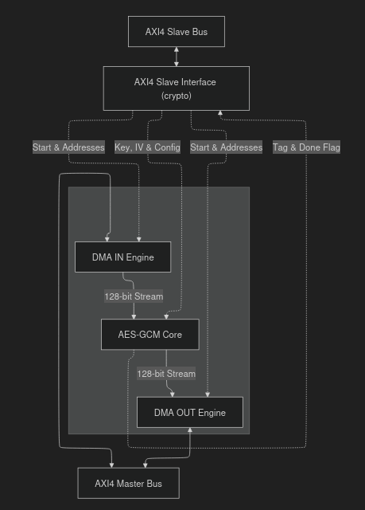

#### CRYPTO

- **Registers :**

| Name | Size | Description |
| --- | --- | --- |
| `reg_start` | 1 bit | Trigger flag to begin the cryptographic operation. |
| `reg_aad_base_addr`<br>`reg_payload_base_addr`<br>`reg_cipher_base_addr` | 32 bits<br>(each) | Pointers to memory locations. |
| `reg_aad_byte_length`<br>`reg_payload_byte_length`<br>`reg_cipher_byte_length` | 32 bits<br>(each) | Byte counts for respective buffers. |
| `reg_key` | 256 bits | Cryptographic key (128, 192, or 256). |
| `reg_key_len` | 2 bits | Configuration flag indicating the key size. |
| `reg_iv` | 96 bits | Initialization Vector for GCM. |
| `reg_tag` | 128 bits | Stores the final generated Authentication Tag. |
| `reg_done` | 1 bit | Hardware status flag indicating operation completion. |
| `aw_addr_lat`<br>`w_data_lat`<br>`ar_addr_lat_r` | 12 bits<br>32 bits<br>12 bits | Handshake latches used to temporarily hold addresses/data during AXI transfers. |

- **Combinatorial Logic:**
    - **Address Decoder :** A `case` statement evaluating `aw_addr_lat(11 downto 2` that routes the 32-bit data from `w_data_lat` to the correct internal configuration register when both the address and data phases have well finished.
    - **Read Multiplexer :** A `case` statement evaluating `ar_addr_lat_r(11 downto 2)` that multiplexes the internal registers onto the 32-bit `s0_axi_rdata_int` bus.
    - **Interrupt / Status Routing :** Direct assignment logic ( `irq <= reg_done` for example) to propagate internal states to external pins asynchronously.

#### DMA IN

- **Block diagram :**

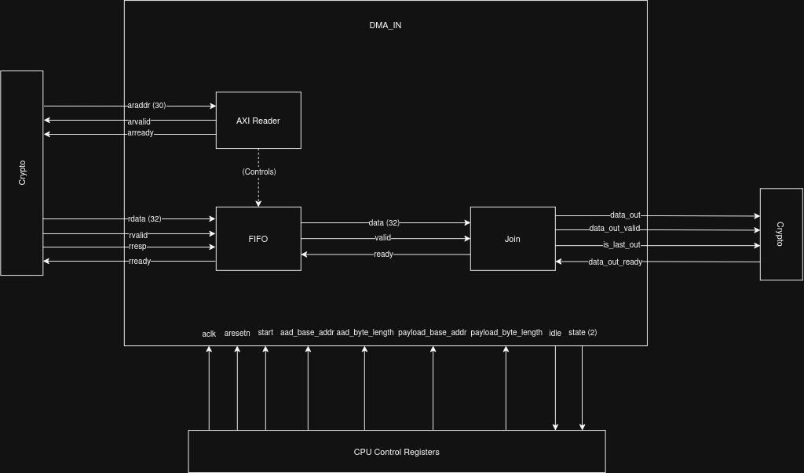

- **Registers :**

| Name | Size | Description |
| --- | --- | --- |
| `current_addr` | 30 bits | Tracks the active AXI memory read pointer. |
| `bytes_to_fetch` | 32 bits | Remaining bytes to request from memory for the active phase. |
| `blocks_to_send` | 28 bits | Number of 128-bit blocks waiting to be formatted and sent to the crypto core. |
| `outstanding_reads` | Int (0-32) | Tracks in-flight AXI AR requests. |
| `payload_addr_reg`<br>`payload_bytes_reg`<br>`payload_blocks_reg` | 30 bits<br>32 bits<br>28 bits | Payload shadow registers. They buffer the payload config so the FSM can transition directly from AAD to Payload without CPU intervention. |

- **Combinatorial Logic:**
    - **Read Request Throttle :** Prevents AXI responses from arriving when the internal FIFO is full by checking if `arvalid` is only asserted when there are bytes left to fetch (`bytes_to_fetch > 0`) and when the system has fewer than 16 `outstanding_reads`.
    - **Last Block Flag (`is_last_out`):** Evaluates the remaining `blocks_to_send` and the current state to assert a flag exactly on the final 128-bit word. The GCM core depends heavily on this for correct zero-padding.
    - **State Broadcaster:** Translates the FSM enum state into a simple 2-bit combinatorial output (`state`) to indicate the GCM core if the incoming data is A or P.

#### DMA OUT

- **Block diagram :**

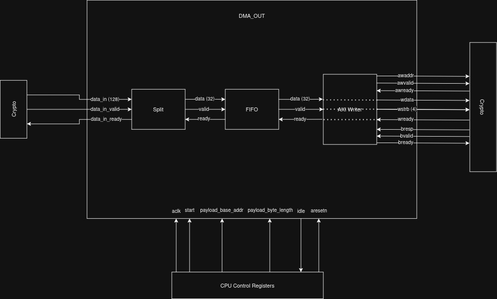

- **Registers :**

| Name | Size | Description |
| --- | --- | --- |
| `aw_addr` | 30 bits | Tracks the active AXI memory write pointer. |
| `words_to_send` | 30 bits | Total number of 32-bit words expected to be written. |
| `aw_sent` | 30 bits | Number of `AW` (Address Write) requests issued. |
| `w_sent` | 30 bits | Number of `W` (Data Write) transactions issued. |
| `b_recv` | 30 bits | Number of `B` (Write Response) acknowledgements received. |

- **Combinatorial Logic:**
    - **FIFO & Split Handshaking:** Determines data availability and space. Check for example if the split is valid and the FIFO not full to safely transfer data between the splitter and the AXI bus without data loss.
    - **Write Strobe Generator:** Statically drives `wstrb <= "1111"` to signal that all four bytes of every 32-bit payload transaction contain valid data.

### 4.3. State Machines

#### CRYPTO

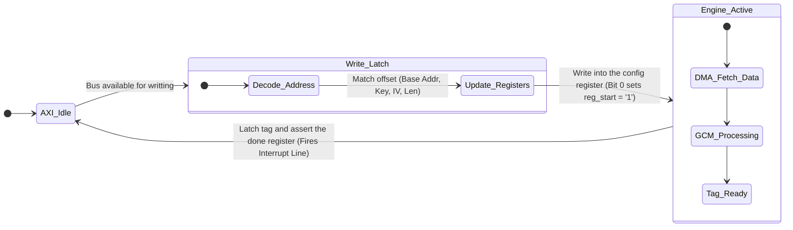

#### DMA_IN

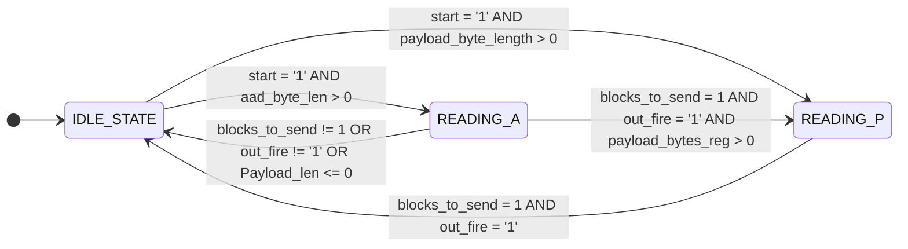

#### DMA_OUT

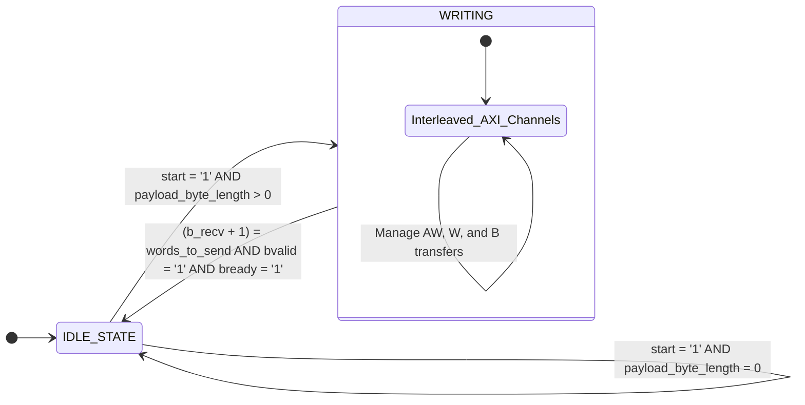

#### GCM

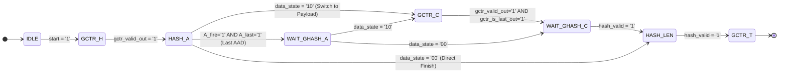

#### GHASH

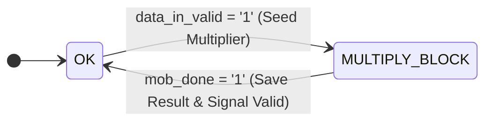

#### CAMELLIA_CORE

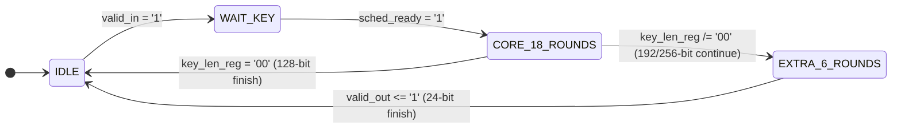

#### KEY_SCHED

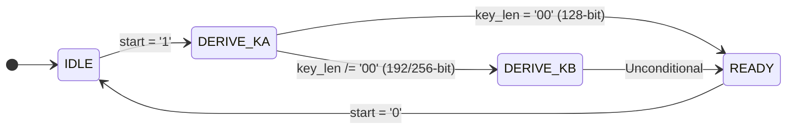

### 4.4. Other block diagrams

#### **GCM**

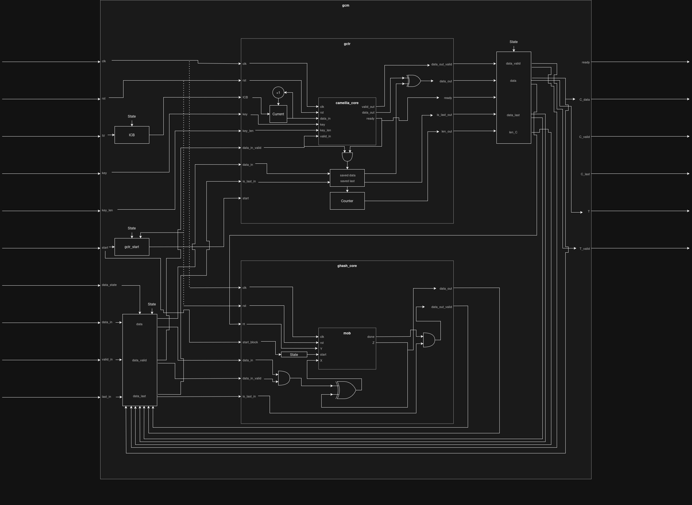

#### **CAMELLIA**

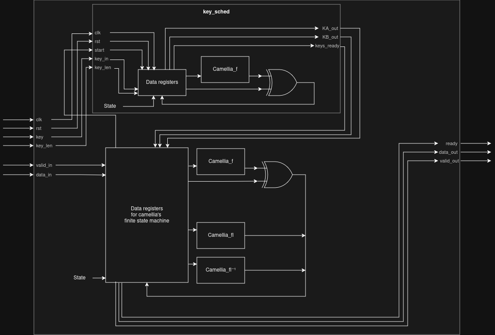

### 4.5. Software-Hardware Interface

As seen earlier, the hardware relies on an AXI interface. The software interaction is managed from user-space on the ARM processor of the Zybo. While initially prototyped using a Python script (full_test.py), the final communication with the cryptographic accelerator is handled by a C "driver" that directly interacts with the hardware via memory-mapped physical addresses as suggested in the project specifications.

- **MMIO :** The driver utilizes the ``/dev/mem`` interface alongside ``mmap()`` to map the physical address ranges of the AXI slave registers and the shared Block RAM (BRAM) into the process's virtual address space. This allows the processor to seamlessly read and write configuration registers (such as keys, IVs, and base addresses) using standard memory assignment operations.

- **Buffer Management :** Rather than relying on DDR and DMA (which would introduce caching and synchronization complexities), data payloads are routed through a dedicated shared BRAM. The driver dynamically allocates physical BRAM offsets for the Plaintext, Associated Data (AAD), and Ciphertext.
  
- **Polling vs. Interrupts :** Instead of relying on hardware interrupts, the software polls the control register's status flag (``REG_CTRL``). Once the done bit is asserted by the hardware, the script retrieves the computed tag directly from the hardware registers and extracts the resulting ciphertext buffer from the BRAM.

> NOTE - Without thinkking about it twice, for speed reason, we implemented it with the BRAM, but so it isn't really possible to properly handle plaintext of 1Go.

Thus, the Python script was utilized to rapidly test our memory-mapping logic against NIST vectors due to time constraints, we translated this logic into a fully functional C driver which allows to freely integrate and deploy our encryption accelerator.

---

## 5. Validation & Testing

To validate each VHDL source file we used test-benches, let us take the example of the Block cipher function (i.e Camellia)

We are given an example data provided in [RFC 3717](https://www.rfc-editor.org/rfc/rfc3713) shown in the image below, we also used multiple edge cases and other cases in general and compared our cipher-text with the expected output:


Below is a screenshot of the pass/fail logs for this testbench.


Other modules where validated using the same method
We used python reference models to produce reference test vectors.

---

## 6. Synthesis Results

### **LUT**


### Max Frequency


---


2.000 + 6.126 = 8.126 ns ⇒ **Max Freq = 123 MHz**

### Analysis

In terms of resource usage, the full design consumes **6,941 LUTs (39.4%)** and **5,931 flip-flops (16.9%)** of the target FPGA. The majority of the logic is concentrated in the cryptographic core (**dut**), which itself is dominated by the GCM block, and more specifically the Camellia cipher implementation. This indicates that the encryption datapath is the primary contributor to both area and timing bottlenecks.

Timing analysis (using a 500 MHz over-constraint) gives a worst negative slack of **-6.126 ns**, leading to a critical path of **8.126 ns** and a maximum operating frequency of about **123 MHz**.

This result is adequate for many FPGA-based cryptographic applications, but it is  below what would be expected from a highly optimized high-speed implementation. The limiting factor is the long combinational path in the Camellia/GCM datapath, which dominates the critical path and prevents higher clock rates.

> NOTE - For timing analysis, the design was synthesized under an intentionally aggressive constraint of **500 MHz (2 ns clock period)**. This is not a realistic performance target, but a deliberate over-constraint used to expose the true maximum frequency of the circuit.
    
    

## 7. Performance

### Python

To evaluate the performance, a testbench based on standard NIST vectors was executed for 128-bit, 192-bit, and 256-bit key sizes. 

Performance was measured using end-to-end hardware execution time.

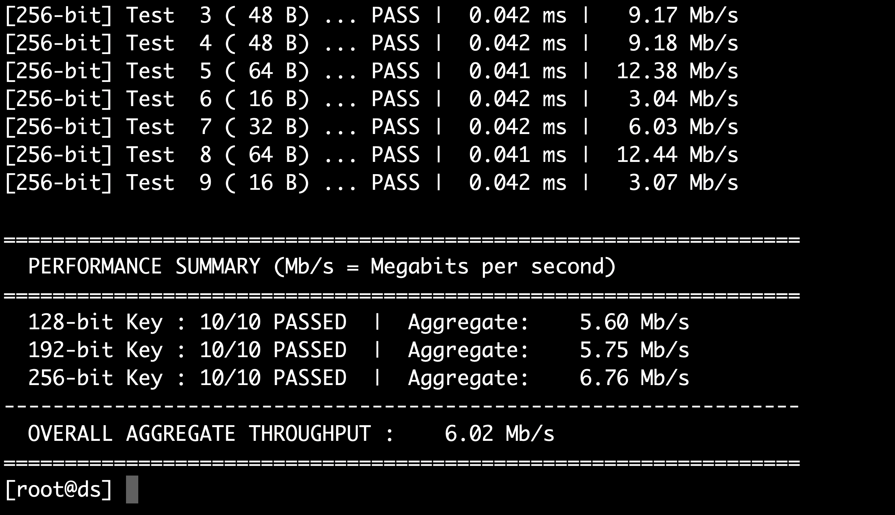

The overall average throughput achieved with the python script was **6.02 Mb/s**.

### C Driver

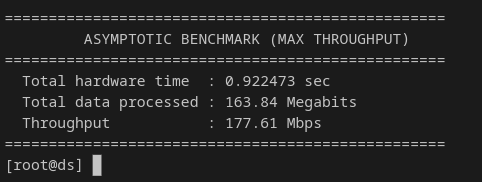

This time, thee overall average throughput achieved was **177.61 Mb/s**.

These results demonstrate that the design is both functionally correct and capable of maintaining stable megabit-per-second throughput across different key configurations under realistic workload conditions.

---

## 8. User Documentation

1. Prepare the SD card
    
    Remove the SD card from the Zybo board.
    
    Copy the contents of `on-board_replication` onto the SD card:
    
    - fpga.bit
    - full_test.py
    - test_vectors.json
    > NOTE - build_zybo.tcl doesn’t have to be copied in the SD but could be used to rebuild fpga.bit
2. Boot and connect the board
    
    Insert the SD card back into the Zybo board.
    
    Connect the board to your laptop via USB.
    
3. Install serial tool
    
    On macOS:
    `brew install picocom`
    
    On Linux (if needed):
    `sudo apt install picocom`
    
4. Open serial connection
    
    Run:
    `sudo picocom -b 115200 /dev/ttyUSB1`
    
    If it fails, check available devices:
    `ls /dev/tty*`
    
    Use the correct ttyUSB or ttyACM entry for the board.
    
5. Run the test
    
    Once connected via picocom:
    
    Navigate to the directory containing the copied files.
    
    Run:
    `python3 full_test.py`
    
6. Expected outcome
    
    The script:
    
    - Loads fpga.bit onto the FPGA
    - Uses test_vectors.json as input data
    - Runs cryptographic accelerator tests
    - Prints results directly in the terminal
    
    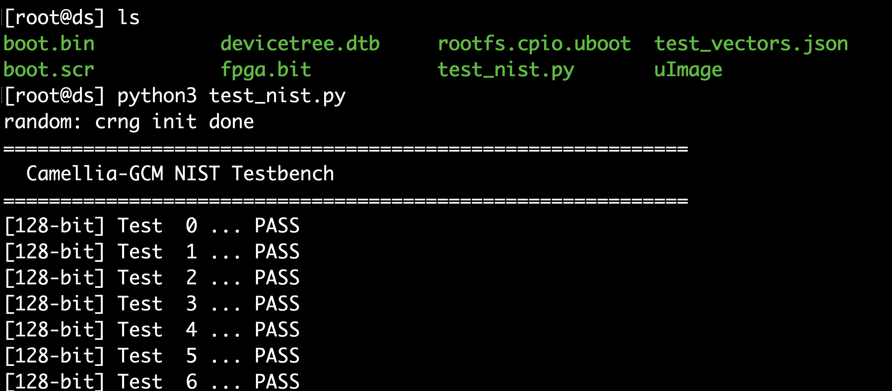
    
    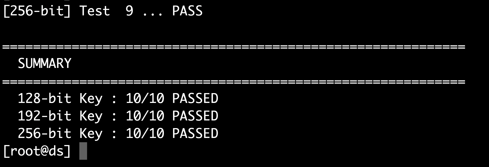
    

---

## 9. Use of AI tools

### 9.1 Tools Used

Several AI assistants were used during the project, primarily for generating test infrastructure and for debugging assistance rather than for core RTL design.

| Tool | Primary use |
| --- | --- |
| ChatGPT (OpenAI) | Testbench generation, Python reference model |
| Claude Code (Anthropic) | Python simulation scripts, and iteration |
| Gemini (Google) | Assistance on VHDL related tasks, second opinion |

The tools were mostly used for two purposes: generating VHDL testbenches from interface descriptions, and writing the Python reference models (`camellia.py`, `gctr.py`, `mob.py`) used to produce reference test vectors.

### 9.2 Examples of Interactions

**Example 1 — Testbench generation**

*Prompt (paraphrased):*

"Generate a VHDL testbench for a Camellia-128 block cipher module. As you can see in the camellia.vhd code, the entity has a 128-bit plaintext input, a 128-bit key input, a clock, a start signal, a done signal, and a 128-bit ciphertext output. Apply the 10 test vectors, the plaintext/ciphertext pairs I sent you, report PASS or FAIL for each, and print a final summary of passed and failed cases."

> The actual `camellia.vhd` source and the 10 plaintext/ciphertext test vectors were provided alongside the prompt."
> 

**Example 2 — Python reference model**

*Prompt (paraphrased):* *Prompt (paraphrased):* "Write a Python implementation of the Camellia-128 block cipher. Have it encrypt the following 10 plaintext/key pairs and print the resulting ciphertexts."

> The 10 plaintext and key values were provided alongside the prompt.
> 

### 9.3 Assessment

AI tools were a net positive overall, but with clear limits depending on the task.

**Where they helped:** The most valuable use case was clearly the test-benches and the Python implementations, these were generated significantly faster than writing from scratch.

Debugging was made easier — providing a block of VHDL alongside a simulator error message typically helped us pinpoint the issue and better understand it.

**Where they fell short:** VHDL code generation quality was generally poor. Outputs frequently contained incorrect signal assignments, wrong sensitivity lists, or logic that appeared plausible but did not synthesise correctly. Every generated VHDL file required careful review.

It was often faster to write from scratch than to repair AI-generated code.

For what it's worth, we noticed that Gemini was generally better at VHDL than other models.

After logic Synthesis AIs fell short and hallucinated a lot, debugging on the zybo board was done manually.

**Conclusion:** AI tools are a reasonable accelerator for low-stakes tasks (testbenches, reference scripts). They are not reliable for RTL design and should not be used there without thorough review. All VHDL source files in this project were written or substantially rewritten by the team.

---

## 10. Use of External Resources

As mentioned previously we used the example data of Camellia provided in [RFC 3717](https://www.rfc-editor.org/rfc/rfc3713)

---
## 11. Authors

| Name | Email |
|------|-------|
| **Justin Avril** | [justin.avril@eurecom.fr](mailto:justin.avril@eurecom.fr) |
| **Jacem Haggui** | [jacem.haggui@eurecom.fr](mailto:jacem.haggui@eurecom.fr) |
| **Antoine Sauger** | [antoine.sauger@eurecom.fr](mailto:antoine.sauger@eurecom.fr) |

**Supervisor:** Renaud Pacalet — EURECOM