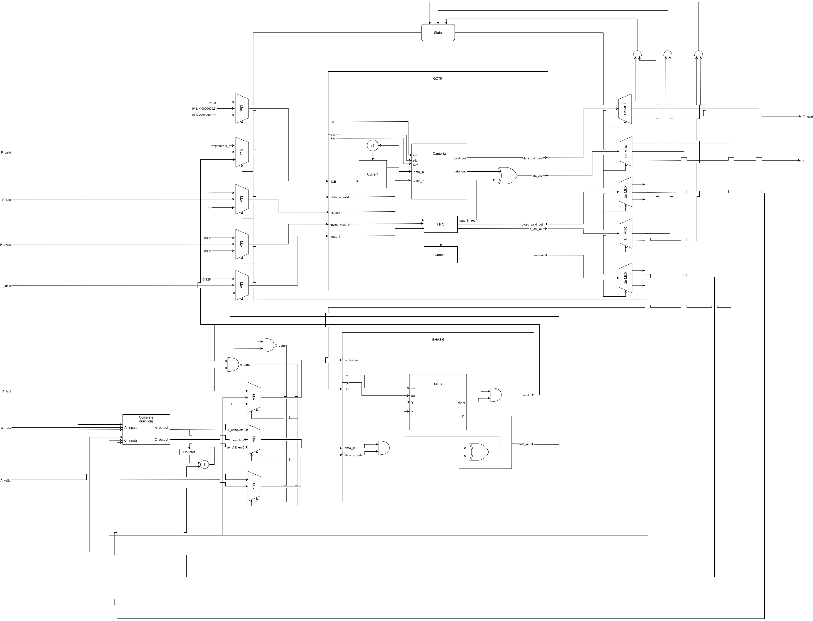

# Crypto GCM Accelerator

## Overview

This project aims to implement a complete hardware and software system for Authenticated Encryption with Associated Data (AEAD).

## Hardware Architecture



### Modules

| File | Entity | Description |
|------|--------|-------------|
| `gcm.vhd` | `gcm` | GCM orchestration |
| `gctr.vhd` | `gctr_core` | Counter mode encryption |
| `ghash.vhd` | `ghash_core` | GHASH authentication |
| `mob.vhd` | `mob_core` | GF(2¹²⁸) multiplier |
| `camellia.vhd` | `camellia_core` | Camellia block cipher |
| `gcm_pkg.vhd` | None | Shared types and constants |

## Repository Structure

```
.
├── vhdl/crypto/       # VHDL source files
└── doc/               # Documentation and diagrams
```

## Authors

| Name | Email |
|------|-------|
| **Justin Avril** | [justin.avril@eurecom.fr](mailto:justin.avril@eurecom.fr) |
| **Antoine Sauger** | [antoine.sauger@eurecom.fr](mailto:antoine.sauger@eurecom.fr) |
| **Jacem Haggui** | [jacem.haggui@eurecom.fr](mailto:jacem.haggui@eurecom.fr) |
